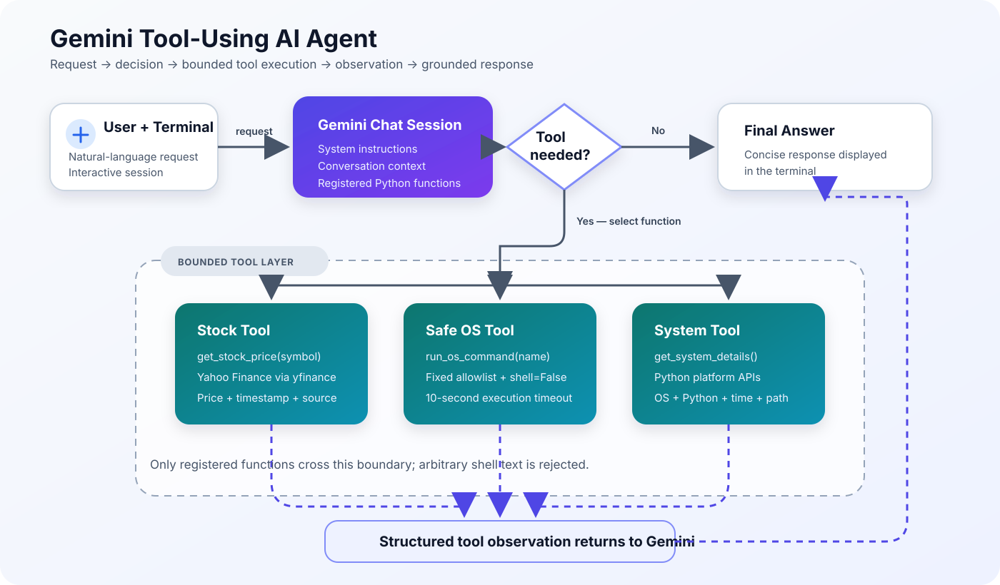

# Gemini Tool-Using AI Agent


> 🤖 **Ask naturally. Let Gemini choose a tool. Inspect the real result.**

A beginner-friendly Python project demonstrating how an AI agent can understand
a request, select a function, observe its result, and answer the user. The agent
can retrieve recent stock-market data, run a small allowlist of safe operating-
system commands, and inspect basic system information.

The source is intentionally heavily commented so learners can follow the full
tool-calling loop without a framework such as LangChain or LangGraph.

> **Important:** Yahoo Finance data can be delayed or unavailable. This project
> is educational and does not provide financial advice. System tools expose local
> metadata; run them only where that output is safe to display.

## ✨ Project at a glance

| | |
| --- | --- |
| **Use case** | Learn Gemini function calling with real Python tools |
| **Reasoning model** | Configurable Gemini model through the official Google Gen AI SDK |
| **Market-data tool** | Latest available stock price through `yfinance` |
| **System tools** | Files, directory, user, host, Python version, and OS information |
| **Safety design** | Command allowlist, argument arrays, `shell=False`, and a 10-second timeout |
| **Interface** | Interactive terminal chat with session context |
| **Learning style** | One extensively commented Python file |

## 🧠 Architecture

[](docs/architecture.svg)

The diagram shows the complete request-to-answer loop and the safety boundary
around the three registered tools. Select it to open the full-size version.

For **“What is Apple's latest stock price?”**, the workflow is:

1. The terminal sends the question to the Gemini chat session.
2. Gemini recognizes that current market data is required.
3. Gemini calls `get_stock_price` with `Apple` or `AAPL`.
4. Python queries `yfinance` and returns structured data.
5. Gemini receives the observation and writes a concise answer.
6. The terminal displays the result.

For a system request, Gemini selects only a name such as `python_version`. The
application—not the model—maps it to a fixed command array.

### 🌟 What makes this project interesting?

- 🧠 **Model-directed tool selection:** Gemini decides whether a request needs a
  tool and chooses the relevant Python function.
- 📈 **Real external data:** stock questions use Yahoo Finance results instead
  of a model-invented price.
- 🛡️ **Constrained local access:** the model chooses a logical operation rather
  than supplying arbitrary shell text.
- 🔄 **Complete agent loop:** the request, tool decision, execution, observation,
  and final response are visible in one small project.
- 🎓 **Beginner-focused implementation:** comments explain both the code and the
  reason behind important architecture and safety choices.

## 👋 Start here if you are new to AI agents

A normal chatbot receives text and returns text. A tool-using agent can pause
before answering and ask the application to perform an action. Here, Gemini can
request one of three Python tools. Python executes it, returns structured data,
and Gemini turns that observation into a short answer.

Think of Gemini as the coordinator and the functions as specialists: Gemini
understands the request, while each function performs one bounded job.

## 🧰 Available tools

### 1. Stock-price lookup

`get_stock_price(symbol)` accepts a ticker or supported company name. It requests
one day of minute-level data, then falls back to five days of five-minute data.
The result includes the ticker, latest available price, timestamp, source, and a
delay notice.

Built-in name mappings include Apple, NVIDIA, Microsoft, Google/Alphabet, Amazon,
Meta, and Tesla. Other ticker symbols can be supplied directly.

### 2. Allowlisted OS commands

`run_os_command(command_name)` accepts only these logical operations:

| Operation | Purpose |
| --- | --- |
| `list_files` | List files in the current directory |
| `current_directory` | Show the active directory |
| `whoami` | Show the current OS user |
| `hostname` | Show the computer host name |
| `python_version` | Show the active Python version |
| `system_info` | Show basic OS information |

The mapping is platform-aware for Windows, Linux, and macOS.

### 3. System details

`get_system_details()` returns the operating system, version, machine type,
Python version, current directory, and local time using Python APIs.

## 🧩 Core concepts

| Concept | Meaning | Use in this project |
| --- | --- | --- |
| AI agent | A model-driven app that can choose actions before answering | Gemini decides whether to invoke a registered function |
| Function calling | A structured model request to application code | The SDK exposes three Python functions as tools |
| System instruction | Rules defining the agent's role and boundaries | The prompt explains tool use and prohibits invented results |
| Tool observation | Data returned after a function runs | Price or system data goes back to Gemini before its answer |
| Allowlist | A small set of explicitly permitted actions | Only six OS operations are available |
| Session context | Conversation history retained during one run | The chat object keeps the current terminal conversation |

## 🛠️ Technology

- **Python** for the application and tool functions
- **Google Gen AI SDK (`google-genai`)** for Gemini and function calling
- **Google AI Studio** for the API key
- **`yfinance`** for recent stock-market data
- **`python-dotenv`** for local configuration
- **`subprocess`** for bounded, allowlisted OS operations

## 🚀 Local setup

### Prerequisites

- Python 3.10 or newer
- A Google AI Studio API key
- Internet access for Gemini and stock requests

### 1. Clone and enter the repository

```bash
git clone https://github.com/cakhiltej9001-source/gemini_agent_vscode_starter.git
cd gemini_agent_vscode_starter
```

### 2. Create a virtual environment

Windows PowerShell:

```powershell
python -m venv .venv
.\.venv\Scripts\Activate.ps1
```

macOS or Linux:

```bash
python3 -m venv .venv
source .venv/bin/activate
```

### 3. Install dependencies

```bash
python -m pip install -r requirements.txt
```

### 4. Configure Gemini

Copy the safe example file:

```powershell
Copy-Item .env.example .env
```

On macOS or Linux, use `cp .env.example .env`. Then replace the placeholder:

```dotenv
GEMINI_API_KEY=your_real_key_here
GEMINI_MODEL=gemini-2.5-flash
```

The real `.env` file is ignored by Git and must never be committed.

### 5. Run the agent

```bash
python gemini_agent_commented.py
```

Type `exit`, `quit`, or `bye` to stop.

## 💬 Example prompts

```text
What is NVIDIA's latest available stock price?
What is Apple's latest available stock price?
List the files in my current directory.
What Python version am I running?
What operating system am I using?
What is my current directory?
```

Example tool trace:

```text
You: What is Apple's latest available stock price?

TOOL CALLED -> get_stock_price('AAPL')
STOCK TOOL RESULT: {...}

Gemini: The latest available Apple (AAPL) price is ...
```

Prices, timestamps, wording, and availability vary. Never treat example output
as a current market quote.

### Recorded terminal session

[`terminal_output.txt`](terminal_output.txt) contains an actual local run showing
successful stock and system-tool calls, provider errors, and graceful recovery.
It is included as evidence of execution, not as a source of current stock prices.

## 🛡️ Safety design

Local command execution is the most sensitive feature. The project limits it in
several ways:

1. Gemini cannot provide arbitrary shell text.
2. The tool accepts only a logical name from a fixed allowlist.
3. Each name maps to an application-owned argument array.
4. `subprocess.run` uses `shell=False`.
5. Each operation has a 10-second timeout.
6. Unknown operations return the permitted choices.

These controls reduce risk, but do not make local tool execution suitable for an
untrusted public deployment. Even permitted commands can reveal local metadata.

The key is loaded from `.env`, which `.gitignore` excludes. If a real key is ever
committed or shared, revoke it in Google AI Studio and create a new one; deleting
the latest copy does not erase it from Git history.

## 📁 Project structure

```text
gemini_agent_vscode_starter/
├── .env.example                Safe configuration template
├── .gitignore                  Secret, environment, and cache exclusions
├── docs/
│   └── architecture.svg        Visual tool-calling architecture
├── gemini_agent_commented.py   Agent, tools, prompts, and terminal loop
├── README.md                   Project guide and learning reference
├── requirements.txt            Python dependencies
└── terminal_output.txt         Recorded example execution
```

Read `gemini_agent_commented.py` from top to bottom. Its numbered sections move
from imports and configuration through tools, instructions, registration, chat
creation, and the interactive loop.

## ⚠️ Known limitations

- Stock prices may be delayed, missing, or temporarily unavailable.
- An unknown company name may be treated as a ticker and return no data.
- Gemini or Yahoo Finance can reject requests because of quotas, model demand,
  network errors, or provider changes.
- Chat context exists only while the process is running.
- There is no web interface, persistent memory, automated evaluation suite, or
  production observability.
- Allowed commands can reveal local metadata and should not be exposed directly
  in a public multi-user application.
- Broad exception handling is useful for a teaching demo but should be narrowed
  and logged carefully in production.

## 🔧 Common issues and resolutions

| Problem | Likely cause | Resolution |
| --- | --- | --- |
| `GEMINI_API_KEY was not found` | `.env` is missing or incorrectly named | Copy `.env.example` to `.env` and add a valid key |
| `503 UNAVAILABLE` | The selected Gemini model is busy | Wait, retry, or choose another available model |
| `429` or quota error | API rate limit or quota was reached | Review AI Studio usage and retry after reset |
| No stock data | Invalid ticker or provider issue | Verify the public ticker and try later |
| Import error | Packages are in another environment | Activate the venv and reinstall requirements |
| Command is not allowed | Request is outside the allowlist | Use one of the documented operations |

## 🔮 Suggested next steps

- Split tools, configuration, and the terminal interface into modules.
- Add tests with mocked Gemini and `yfinance` responses.
- Add bounded retries with exponential backoff for transient failures.
- Validate ticker symbols before querying the provider.
- Add structured logging without storing secrets or sensitive tool output.
- Evaluate tool selection, invalid arguments, refusals, and result grounding.

## 🎤 Common interview questions and sample answers

### What makes this an agent rather than a normal chatbot?

The model can choose an action, observe its result, and use that observation in
its response. A normal text-only chatbot answers directly.

### Why return dictionaries from tools?

Structured fields make success, failure, provenance, and values easier for the
model and application to interpret than an unstructured paragraph.

### Why not let Gemini write any terminal command?

Arbitrary commands create a large security boundary. An allowlist restricts the
model to predefined operations that the application owns and can review.

### Why use `shell=False`?

It executes a prepared argument array directly instead of asking a shell to parse
a model-controlled string, reducing shell-injection risk.

### How does the project reduce invented stock prices?

The instructions require the stock tool for current-price questions, and the
function retrieves external data with a source and timestamp. A production app
would add stronger application-level validation and monitoring.

### How would you make this production-ready?

I would isolate tools behind strict schemas and permissions, then add auth, rate
limits, retries, structured logging, monitoring, automated evaluations, narrower
exception handling, and a deployment-specific privacy and threat review.

## 📌 Responsible use

This is a learning project. Verify market data with an authoritative financial
source before acting, never expose the API key, and do not add powerful system
commands without a careful threat model and permission design.
